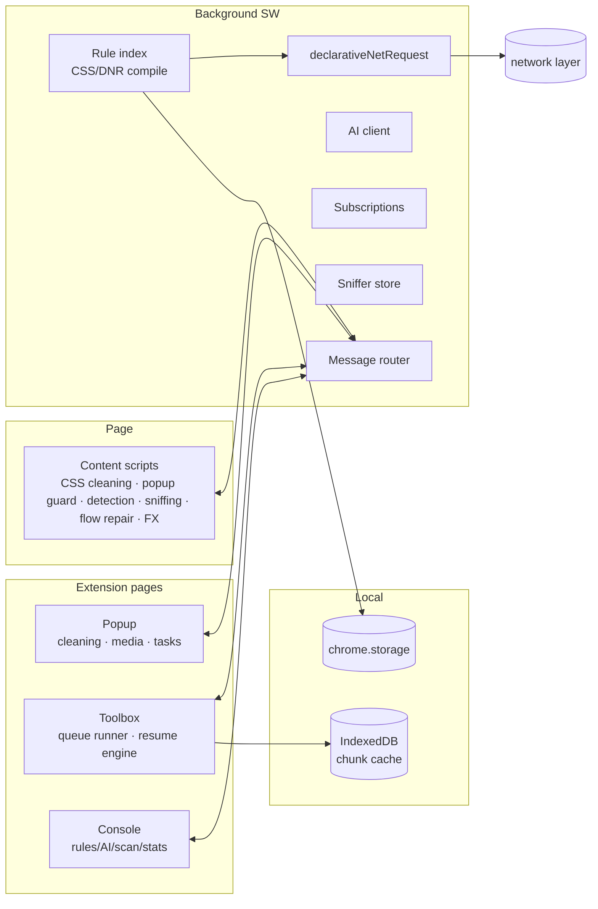

<div align="center">

# ZeroZen · 零真

**Cross-browser ad & popup cleaner — rule engine + AI detection + resumable download toolbox**

[](https://github.com/sevenaaaaaaaaa/zerozen/releases)
[](#-rules)
[](#-install)
[](#-install)
[](#-install)
[](#-licence)

100% local · no backend · never collects or uploads any browsing data

[Install](#-install) · [Features](#-features) · [Rules](#-rules) · [AI detection](#-ai-detection) · [Download toolbox](#-download-toolbox) · [Development](#-development)

中文说明：[README.md](README.md)

</div>

---

## ✨ Features

**🛡 Full-stack cleaning** — network-level `declarativeNetRequest` blocking + cosmetic CSS hide/remove + popup guard (hijacks gesture-less `window.open`) + feed gap auto-repair, four layers working together

**🧠 AI detection** — send structured element descriptions to **your own** OpenAI-compatible endpoint (OpenAI / DeepSeek / GLM / Qwen / SiliconFlow / local Ollama) to catch native ads and fake download buttons; off by default, cached and rate-limited

**🎯 Pick & block** — `Alt+Z` any element to create a hide/remove/allow rule; learns selector patterns from AI results and bulk scans, generalizes them across sites

**📡 Filter subscriptions** — 10 presets including EasyList / EasyPrivacy / anti-AD / AdGuard / uBlock / CJX, with conditional auto-update, mirror failover, and Adblock / hosts / domain-list / JSON support

**⬇️ Download toolbox** — video sniffing (finds streams without pressing play) → m3u8 decryption & merge → **chunk-level resumable downloads** → auto file categorization; runs in the background, survives popup close

**📖 Reader mode** — one-click article extraction with a page-settle animation; Clean View hides nav/sidebar/comments in one tap

**⚡ LAN-friendly** — disabled by default on private networks / NAS / router consoles / online docs (Feishu, Tencent Docs, Notion…), so admin panels and document editing just work

**🌍 39 rule packs · 7,270 rules** — covering CN/JP/KR/RU/EU/SEA/IN/LATAM sites, each pack individually switchable

## 🚀 Install

### Chrome / Edge / Brave / Arc

> Chrome 105+

1. Clone or download this repo
2. Open `chrome://extensions` → enable **Developer mode**
3. **Load unpacked** → select **`dist/chrome`** (or the repo root)

### Firefox

> Firefox 128+

Load `dist/firefox/manifest.json` via about:debugging, or install `dist/zerozen-firefox-0.8.1.xpi` for long-term use.

### Safari (macOS 13+ / iOS 16.4+)

```bash
npm run build && npm run build:safari
```

Run once in Xcode, then enable ZeroZen in Safari settings.

## 🛡 Privacy

| Promise | Detail |
| --- | --- |
| 🚫 No backend | No servers, no analytics, never uploads browsing data |
| 🔒 Blind to network traffic | Blocking runs on the browser's `declarativeNetRequest` engine |
| 🔑 Opt-in permissions | `bookmarks` / `history` / `downloads` / `webRequest` requested on first use, revocable anytime |
| 🤖 Your AI, your data | AI requests go straight to the endpoint you configure; element descriptions only, never page text or screenshots |

Full policy: [docs/privacy-policy.md](docs/privacy-policy.md)

## 🧩 Rules

**39 rule packs, 7,270 rules**, individually switchable, with word-boundary selector hygiene to avoid false positives. Conflict order: custom rules > built-in packs > subscriptions.

<details>
<summary><b>All rule packs</b></summary>

| Group | Packs | Coverage |
| --- | --- | --- |
| Common | Core / Ad networks / Annoyances / Long-tail / OSS merge | Generic slots + 49 ad networks; Taboola/Outbrain/Baidu Union/Adsterra; cookie walls, paywalls, app nagging; merged EasyList/AdGuard/uBlock/CJX/1Hosts |
| Search & social | Search / CN social / Global social / Forums / Zhihu / Reddit / LinkedIn | Google/Baidu/Bing ads; Weibo/Xiaohongshu/Douban; X/Facebook/TikTok; Discuz/Hupu/NGA |
| Video | YouTube / CN video / Live | In-video ad skipping; Bilibili/iQiyi/Youku/Douyin; Douyu/Huya/Twitch |
| News & shopping | Native ads / Tech communities / E-commerce / Portal overlays / AI tool sites | CSDN/Juejin; Taobao/JD/Amazon; hao123/2345/360 overlays; AI directories |
| Media | Music / Gaming / Sports | Spotify/NetEase Music; IGN/3DM; ESPN/LiveScore |
| Life | Finance / Travel / Education / Tools & drives / Local life / Cloud-drive promos | Eastmoney/Xueqiu; Ctrip/Booking; CNKI; Meituan/Ele.me popups; Baidu Netdisk/Quark promos |
| Regions | JP / KR / RU / EU / SEA / IN / LATAM / HK-TW | Yahoo!JAPAN, Naver, Yandex, Bild/Le Monde, VnExpress, Times of India, UOL, Bahamut/HK01 and regional ad networks |
| Vertical | Warez / Adult | Fake download buttons; ExoClick/JuicyAds networks |

</details>

Custom rules via element picker, AI detection, bulk scan, or manual import (Adblock / hosts / domain list / JSON). Shortcuts: <kbd>Alt+Z</kbd> pick & block · <kbd>Alt+A</kbd> AI scan page.

## 🤖 AI detection

Point it at any OpenAI-compatible endpoint in the console — OpenAI, DeepSeek, GLM, Qwen, SiliconFlow, or local Ollama. Only structured element descriptions are sent (never page text or screenshots), with per-run limits and a 14-day cache. Results land in a review queue, or auto-apply above your confidence threshold.

## ⬇️ Download toolbox

Sniff → download → merge → categorize → manage:

- Chunk-level resumable downloads (IndexedDB persisted), 1–12 threads, best-quality auto-selection, AES-128 decryption, expired-URL auto-refresh
- Integrity-checked merge to `.mp4`/`.ts`, cache auto-cleanup on success
- Task center in the popup with category/state filters, five sort modes, live speed; failure reasons in plain language with one-click GitHub diagnostics

<details>
<summary><b>Architecture</b></summary>



</details>

## 🧑‍💻 Development

Zero-dependency plain JavaScript:

```bash
npm test             # 146 checks · rule validation · 185 assertions
npm run build        # dist/{chrome,firefox,safari} + zip/xpi
npm run import:lists # rebuild merged OSS rules
```

Directories: `background/` engine · `content/` page scripts · `ui/` three surfaces · `rules/` 39 packs · `i18n/` dictionaries

## ⚠️ Known limitations

<details>
<summary><b>Expand</b></summary>

- YouTube in-video ads use mute+skip; rare live/long ads may flash for a moment
- Quick scan can't see JS-injected ads; render scan is bounded by a 20s timeout
- Large subscriptions are bounded by the dynamic-rule budget (4,500 default, ~30,000 on Chrome 121+)
- m3u8 AES-128 supported; SAMPLE-AES/DRM is not
- Multi-threaded downloads need server `Range` support, 2GB cap; background tasks run in the toolbox tab
- Safari lacks the bookmarks API; use the custom site list for bulk scans

</details>

## 💛 Pay-what-you-want

Reader save, video sniffing, image discovery and netdisk collection are free — a support link sits in the console if you find them useful.

## 📄 Licence

[MIT](LICENSE) · OSS merge rules generated from EasyList / EasyPrivacy / AdGuard / uBlock Origin / CJX / 1Hosts / Peter Lowe, see [docs/oss-sources.md](docs/oss-sources.md)

---

<div align="center">

**If ZeroZen helps you, consider starring ⭐ the repo**

</div>
