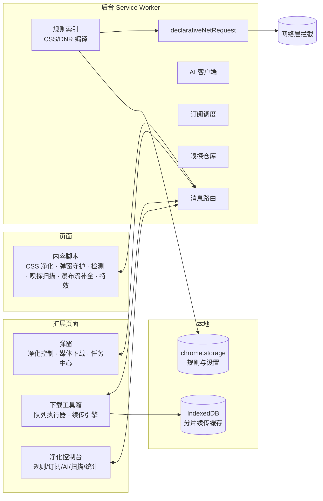

<div align="center">

# 零真 · ZeroZen

**跨浏览器广告与弹窗净化扩展 —— 规则引擎 + AI 识别 + 断点续传下载工具箱**

[](https://github.com/sevenaaaaaaaaa/zerozen/releases)
[](#-规则)
[](#-安装)
[](#-安装)
[](#-安装)
[](#-许可)
[](#-多语言)

纯本地运行 · 无后端 · 不收集不上传任何浏览数据

[安装](#-安装) · [特性](#-特性) · [规则](#-规则) · [AI 识别](#-ai-识别) · [下载工具箱](#-下载工具箱) · [开发](#-开发)

English: [README.en.md](README.en.md)

</div>

---

## ✨ 特性

**🛡 全栈净化** — 网络层 `declarativeNetRequest` 拦截 + 外观层 CSS 隐藏/移除 + 弹窗守护（劫持无手势 `window.open`）+ 信息流空位自动回填，四层协同不留空洞

**🧠 AI 自主识别** — 把页面元素的结构化描述发给**你自己填**的 OpenAI 兼容接口（OpenAI / DeepSeek / 智谱 / 通义 / 硅基流动 / 本地 Ollama），识别规则覆盖不到的原生广告与假下载按钮；默认关闭、带缓存与限额

**🎯 点选即规则** — `Alt+Z` 选中页面元素直接生成隐藏 / 移除 / 放行规则；从 AI 结果与批量扫描中自动学习选择器模式，多站点复现自动通用化

**📡 规则订阅** — 内置 EasyList / EasyPrivacy / anti-AD / AdGuard / uBlock / CJX 等 10 个预设源，条件请求自动更新、备用地址自动切换、Adblock / hosts / 纯域名 / JSON 四种格式通吃

**⬇️ 下载工具箱** — 视频嗅探（不点播放也能发现）→ m3u8 解密合并 → **分片级断点续传** → 按类型自动归档；后台执行，关掉弹窗也不中断

**📖 阅读模式** — 一键提取正文，页面收束动画后进入无干扰阅读；纯净浏览一键隐藏导航/侧栏/评论

**⚡ 内网友好** — 私网 / NAS / 路由器后台 / 在线文档（飞书、腾讯文档、Notion…）**默认不启用**，管理后台与文档编辑零干扰

**🌍 41 个规则包 · 7283 条规则** — 覆盖中/日/韩/俄/欧/东南亚/印度/拉美/港澳台站点，全部可独立开关

<div align="center">

| 弹窗内直接下载 | 净化波特效 | 阅读模式收束动画 |
|:---:|:---:|:---:|
| 嗅探列表 + 分类任务中心 | ✨ 一键去广告扫光徽章 | 复杂 → 干净的全过程 |

</div>

## 🚀 安装

### Chrome / Edge / Brave / Arc

> 要求 Chrome 105+

1. 下载本仓库或 `git clone`
2. 打开 `chrome://extensions` → 右上角开启「开发者模式」
3. 「加载已解压的扩展程序」→ 选择 **`dist/chrome`**（或仓库根目录）
4. Chrome Web Store 版本审核中，上架后可直接安装

### Firefox

> 要求 Firefox 128+

1. 「临时载入附加组件」→ 选择 `dist/firefox/manifest.json`
2. 长期使用：安装 `dist/zerozen-firefox-0.8.1.xpi`（Firefox 请用 dist 产物，根目录清单是 Chrome MV3 专用）

### Safari（macOS 13+ / iOS 16.4+）

```bash
npm run build          # 生成 dist/safari
npm run build:safari   # 转成 Xcode 工程
```

Xcode 中 Run 一次后，Safari → 设置 → 扩展 → 勾选零真并允许访问所有网站。

## 🛡 隐私

| 承诺 | 说明 |
| --- | --- |
| 🚫 无后端 | 扩展没有服务器，不收集、不上传任何浏览数据 |
| 🔒 网络拦截不可见 | 由浏览器 `declarativeNetRequest` 引擎完成，扩展看不到任何请求内容 |
| 🔑 权限按需 | `bookmarks` / `history` / `downloads` / `webRequest` 安装时不申请，第一次用到才询问，随时可收回 |
| 🤖 AI 你说了算 | 只有你主动启用 AI 识别才发请求，直接发往你填写的地址，只传元素描述不传网页正文 |

完整说明见 [docs/privacy-policy.md](docs/privacy-policy.md) · 上架材料见 [docs/store-listing.md](docs/store-listing.md)

## 🧩 规则

内置 **41 个规则包、7283 条规则**，按分组独立开关；选择器一律做词边界处理（`[class^='ad-slot']` 而非 `[class*='ad-slot']`），不会误伤 `download-slot` 这类正常类名。冲突时：自定义规则 > 内置包 > 订阅规则。

<details>
<summary><b>📋 全部规则包一览（点击展开）</b></summary>

| 分组 | 规则包 | 覆盖 |
| --- | --- | --- |
| 通用拦截 | 核心拦截 / 广告联盟 / 弹窗骚扰 / 长尾站点通用 / 开源合并规则 | 通用广告位 + 49 个投放域名；Taboola/Outbrain/百度联盟/Adsterra 等；Cookie 同意框/登录墙/付费墙/App 浮层；小说漫画站模板广告；EasyList/AdGuard/uBlock/CJX/1Hosts 去重合并 |
| 搜索/社交 | 搜索引擎广告 / 国内社交资讯 / 海外社交 / 论坛 BBS / 知乎 / Reddit / LinkedIn | Google/百度/Bing 推广位；微博/小红书/豆瓣/贴吧/头条；X/Facebook/TikTok/Quora；Discuz/虎扑/NGA；垂直站专项 |
| 视频/直播 | YouTube / 国内视频 / 直播平台 | YouTube 播放内广告自动跳过；B站/爱奇艺/优酷/抖音/快手；斗鱼/虎牙/Twitch |
| 资讯/电商 | 资讯原生广告 / 技术社区 / 电商平台 / 导航门户浮层 / AI 工具站 | 信息流原生广告；CSDN/掘金/博客园；淘宝/京东/Amazon；hao123/2345/360 浮层与百度联盟；AI 导航站推广卡 |
| 影音娱乐 | 音乐音频 / 游戏电竞 / 体育站点 | Spotify/网易云/QQ音乐；IGN/游民星空/3DM；ESPN/直播吧/懂球帝 |
| 生活服务 | 财经股票 / 旅游出行 / 教育文档 / 工具网盘天气 / 本地生活外卖 / 网盘页面推广 | 东方财富/同花顺/雪球；携程/Booking/马蜂窝；知网/百度文库；天气/快递/下载站；美团/饿了么/点评弹窗；百度网盘/夸克/115 会员弹窗 |
| 区域站点 | 日本 / 韩国 / 俄罗斯独联体 / 欧洲 / 东南亚 / 印度 / 拉美 / 港澳台 | Yahoo!JAPAN、Naver、Yandex、Bild/Le Monde、VnExpress、Times of India、UOL、巴哈姆特/HK01 及各区域广告联盟 |
| 垂直站点 | 资源下载站 / 成人站点 | 假下载按钮/高速下载诱导；ExoClick/JuicyAds 等联盟 |

</details>

**自定义规则**三条途径：元素选取器、AI 识别、批量扫描，也支持手动导入 Adblock 语法 / hosts / 纯域名 / JSON。格式细节见 [docs/rules-format.md](docs/rules-format.md)。

快捷键：<kbd>Alt+Z</kbd> 选取元素屏蔽 · <kbd>Alt+A</kbd> AI 识别本页

## 🤖 AI 识别

控制台 →「AI 识别」→ 填任意 OpenAI 兼容接口即可启用：

<details>
<summary><b>预设服务与隐私细节（点击展开）</b></summary>

| 服务 | 地址 | 模型 |
| --- | --- | --- |
| OpenAI | `https://api.openai.com/v1` | `gpt-4o-mini` |
| DeepSeek | `https://api.deepseek.com/v1` | `deepseek-chat` |
| 智谱 GLM | `https://open.bigmodel.cn/api/paas/v4` | `glm-4-flash` |
| 通义千问 | `https://dashscope.aliyuncs.com/compatible-mode/v1` | `qwen-plus` |
| 硅基流动 | `https://api.siliconflow.cn/v1` | `Qwen/Qwen2.5-7B-Instruct` |
| 本地 Ollama | `http://127.0.0.1:11434/v1` | `qwen2.5:7b`（Key 可留空） |

只发送元素的结构化描述（标签/class/id/尺寸/最多 140 字短文本）与页面地址标题，**不上传正文、不截图、不传 Cookie**。单次元素数/调用次数/置信度/超时可配置，同一元素 14 天缓存不重复调用。识别结果先进「待审」，可一键全部屏蔽或逐条确认。

</details>

## ⬇️ 下载工具箱

一条龙：**嗅探 → 下载 → 合并 → 归档 → 管理**

- **嗅探**：监听 m3u8/mpd 请求 + 扫描页面 DOM/脚本/`data-*` 属性，不点播放也能发现视频流
- **下载**：m3u8 分片级断点续传（IndexedDB 持久化，取消/失败/关页后继续）、多线程并发 1-12、自动选最高画质、AES-128 自动解密、分片地址失效自动重拉
- **合并**：按序合并 fMP4/TS 自动保存 `.mp4/.ts`，合并前完整性校验，绝不静默产出坏视频，保存成功自动清理缓存
- **管理**：弹窗「任务中心」+ 工具箱下载器；视频/音频/图片/压缩包/文档分类归档到 `ZeroZen/` 子目录；状态筛选 + 五种排序 + 实时速度；失败原因中文化并附解决建议，一键生成诊断报告直达 GitHub 反馈

<details>
<summary><b>架构一览</b></summary>



</details>

## 🗺 路线图

- [x] 断点续传与后台任务队列（v0.8.0）
- [x] 弹窗内创建下载任务 + 分类任务中心（v0.8.0）
- [x] 内网/在线文档默认关闭（v0.8.1）
- [ ] Chrome Web Store 上架（材料就绪，审核中）
- [ ] 云端规则订阅源（自托管规则 feed）
- [ ] 更多站点适配与社区规则共享

### 使用细节打磨（进行中）

**误伤防护**

- [x] 登录/注册弹窗保护：删除「含邮箱输入框即隐藏」宽匹配与 X/淘宝/京东/微博/Instagram/斗鱼 的真登录框隐藏规则；浮层清理跳过含表单/验证码的弹窗
- [x] 白名单父域继承：父域停用覆盖全部子域（`www`/`m.`/深层子域），单个子域可显式启用覆盖父域
- [x] 页内误拦反馈：工具箱「误拦反馈」页签扫描被隐藏元素，一键放行生成本站豁免规则
- [ ] 误拦快速撤销：popup 列出本页最近被隐藏的元素，逐个恢复
- [ ] 规则回归样本集：登录框 / 播放器 / 购物车 / 评论区黄金样本，新规则合入前自动跑

**白名单与站点管理**

- [x] 控制台白名单管理页：列表 / 搜索 / 批量删除 / 导入导出
- [x] popup 标注白名单来源（本站设置 / 继承自 example.org / 临时放行剩余时间）
- [ ] 临时解除一键转正为白名单

**界面与任务细节**

- [x] 本页拦截明细：popup 按规则包聚合显示本页命中（自定义规则单列；单条停用待后续）
- [ ] 工具栏徽章显示当日拦截数（可关闭）
- [x] 下载失败原因中文化 + 一键重试
- [ ] 任务完成系统通知（可关）
- [ ] 工具箱记住上次停留的页签

**新手引导**

- [ ] 首次安装引导页：逐条说明权限用途、推荐预设订阅、选择档位
- [ ] 大版本更新后的 changelog 浮层

**性能与稳定**

- [ ] 超大页面规则应用耗时预算，超时自动降级快扫
- [ ] MutationObserver 分帧调度，长任务不阻塞页面输入

> 💡 欢迎提 Issue 反馈误杀/漏杀站点——失败报告按钮会自动附上诊断信息。

## 🧑‍💻 开发

纯 JavaScript 零依赖，源码目录可直接加载调试：

```bash
npm test             # check + validate + selftest（148 项检查 · 规则校验 · 217 条断言）
npm run check        # 语法 + manifest 引用完整性 + 中英文案完整性
npm run validate     # 规则包校验（选择器安全性、DNR 预算）
npm run selftest     # 沙箱自测
npm run build        # 生成 dist/{chrome,firefox,safari} 与 zip/xpi
npm run import:lists # 重新合并开源过滤列表 → rules/pack-oss.json
```

目录：`background/` 后台引擎（规则编译/AI/扫描/嗅探）· `content/` 内容脚本（净化/检测/瀑布流补全/特效）· `ui/` 三个界面 · `rules/` 41 个规则包 · `i18n/` 中英词典

## ⚠️ 已知限制

<details>
<summary><b>点击展开</b></summary>

- YouTube 视频内广告采用静音+快进+跳过组合策略，极少数直播/长广告可能有一瞬画面
- 快扫看不到 JS 动态插入的广告；渲染扫描受页面超时（默认 20s）限制
- 遇到反广告拦截墙会自动回落档位，也可手动切换；清单见 [docs/compatibility.md](docs/compatibility.md)
- 订阅列表过大时网络规则受动态规则预算截断（默认 4500，Chrome 121+ 可调至 ~30000）
- 隐藏 Cookie 同意框不替你完成授权；单站点拦截数为规则命中估算（浏览器不提供明细）
- m3u8 支持 AES-128；SAMPLE-AES/DRM 无法下载。TS 可用 `ffmpeg -i in.ts -c copy out.mp4` 转封装
- 多线程分段下载需服务器支持 `Range`，上限 2GB；后台任务由工具箱标签页执行，关闭该页下载暂停（进度保留）
- Safari 不支持收藏夹接口，批量扫描请用自定义站点列表；Safari 16.4 以下仅外观规则

</details>

## 💛 诚实付费

阅读保存、视频嗅探、图片发现、网盘收集**功能免费**，觉得好用请在控制台配置的支持链接付费。

## 📄 许可

[MIT](LICENSE) · 内置规则包为原创整理；「开源合并规则」由 [npm run import:lists] 从 EasyList / EasyPrivacy / AdGuard / uBlock Origin / CJX / 1Hosts / Peter Lowe 自动转换生成，各列表版权与许可证见 [docs/oss-sources.md](docs/oss-sources.md)

---

<div align="center">

**如果零真帮到了你，点个 ⭐ Star 让更多人看到**

</div>
